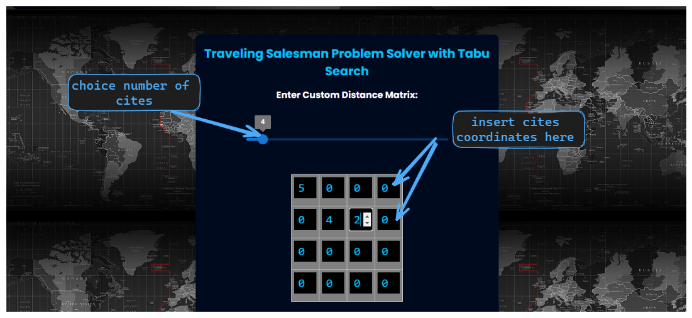
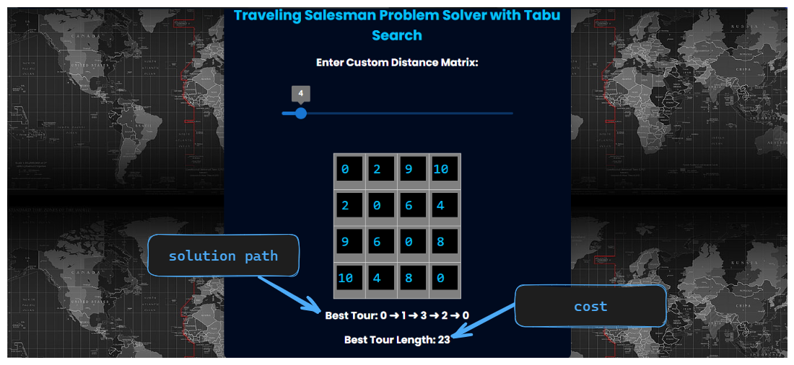

# Project Report: TSP Tabu Search

## Team Members
-  Abdellah Massoun 
([GitHub](https://github.com/abdomassoun))

-  Mohammed Azizou
([GitHub](https://github.com/abdomassoun))

## Introduction
The TSP Tabu Search project aims to solve the Traveling Salesman Problem (TSP) using the Tabu Search algorithm. The TSP is a classic optimization problem where the goal is to find the shortest possible route that visits a given set of cities and returns to the starting city.

## Theoretical Background
The Traveling Salesman Problem (TSP) is a well-known combinatorial optimization problem in computer science. It involves finding the shortest possible route that visits a set of cities exactly once and returns to the starting city. The TSP has numerous real-world applications, such as route planning, logistics, and circuit board manufacturing.

## Tabu Search Algorithm
Tabu Search is a metaheuristic algorithm used to solve combinatorial optimization problems like the TSP. It is inspired by the concept of "tabu" in game theory, which refers to moves that are temporarily forbidden. The algorithm explores the solution space by iteratively making moves and keeping track of the best solutions found so far. It uses a tabu list to prevent revisiting recently explored solutions and employs various strategies to escape local optima.

## Methodology
The project will be implemented using the React framework, which provides a robust and efficient environment for building web applications. The Tabu Search algorithm will be implemented in JavaScript, leveraging the power of React's component-based architecture.

### Traveling Salesman Problem (TSP)

The Traveling Salesman Problem (TSP) is a classic problem in computer science and optimization theory. It can be framed mathematically as follows:

Given a set of cities and the distances between each pair of cities, the objective is to find the shortest possible route that visits each city exactly once and returns to the original city.

Let's denote the following:

- \( n \): the number of cities
- \( d_{ij} \): the distance between city \( i \) and city \( j \), where \( i, j \) are indices from \( 1 \) to \( n \)
- \( x_{ij} \): a binary decision variable that equals \( 1 \) if the salesman travels directly from city \( i \) to city \( j \), and \( 0 \) otherwise

With these notations, we can formulate the TSP as an integer linear programming (ILP) problem:

Minimize ∑_{i=1}^{n} ∑_{j=1, j\neq i}^{n} d_{ij} * x_{ij}
 subject to:

1. **Each city must be visited exactly once:**

∑_{i=1, i\neq j}^{n} x_{ij} = 1, \quad \text{for } j = 1, 2, ..., n

2. **Each city must leave exactly once:**

∑_{j=1, j\neq i}^{n} x_{ij} = 1, \quad \text{for } i = 1, 2, ..., n

3. **Eliminate sub-tours (optional but necessary for the classical TSP):**
This constraint ensures that there's only one loop connecting all cities. One common way to formulate this constraint is using Miller-Tucker-Zemlin (MTZ) constraints. For each subset \( S \) of cities other than the empty set and the full set, the sum of the binary variables \( x_{ij} \) for all arcs \( (i, j) \) that cross from a city in \( S \) to a city outside \( S \) must be greater than or equal to \( |S| \).

Solving the ILP defined above directly is challenging due to the combinatorial explosion of possible routes. Therefore, various optimization techniques are used, among which is Tabu Search.

## How to Use
To use the TSP Tabu Search project, follow these steps:

1. Clone the repository to your local machine.
2. Install the necessary dependencies by running the command `npm install`.
3. Run the project by executing the command `npm start`.
4. Access the application in your web browser at `http://localhost:3000`.
5. Input the TSP instance details, such as the number of cities and their coordinates.
see image below :

6. View the solution path and the shortest route and cost.

## Conclusion
In conclusion, the TSP Tabu Search project aims to provide a practical implementation of the Tabu Search algorithm for solving the TSP, without optimizing the algorithm.
